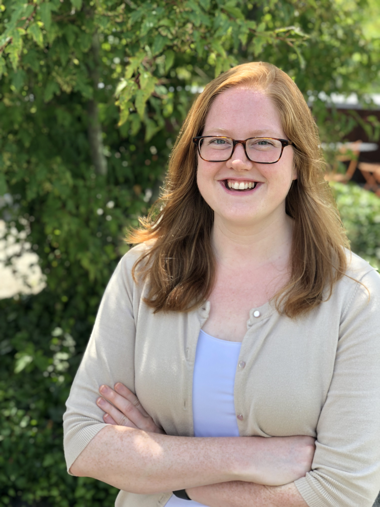
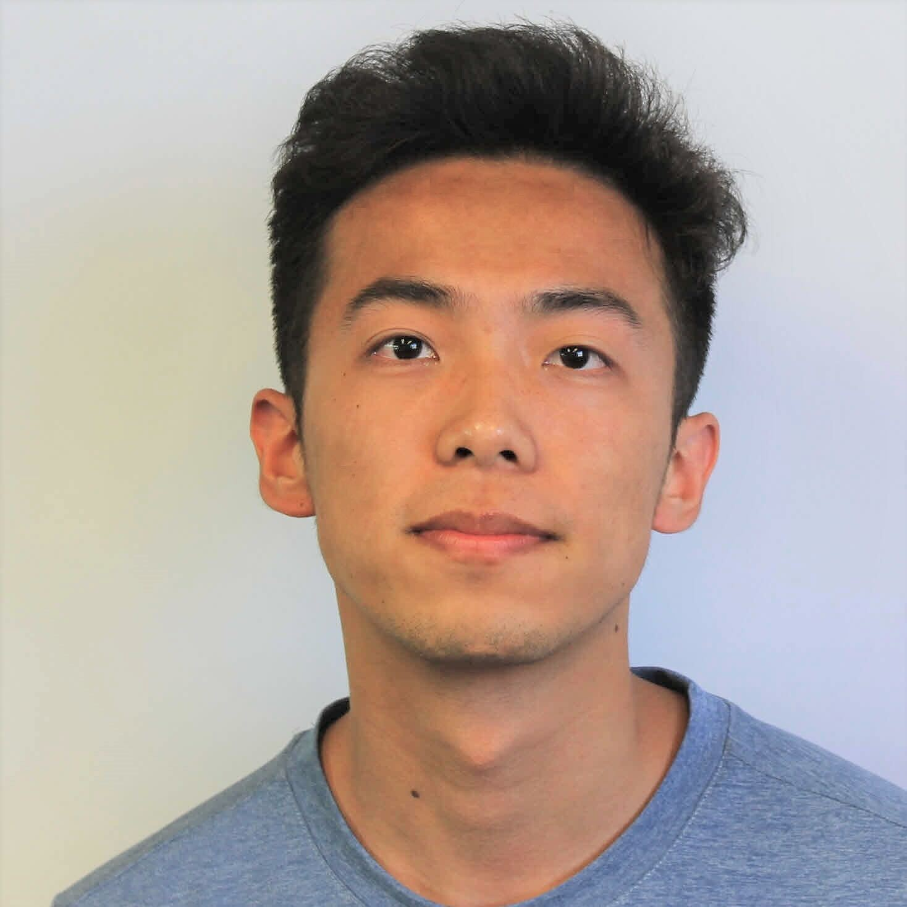
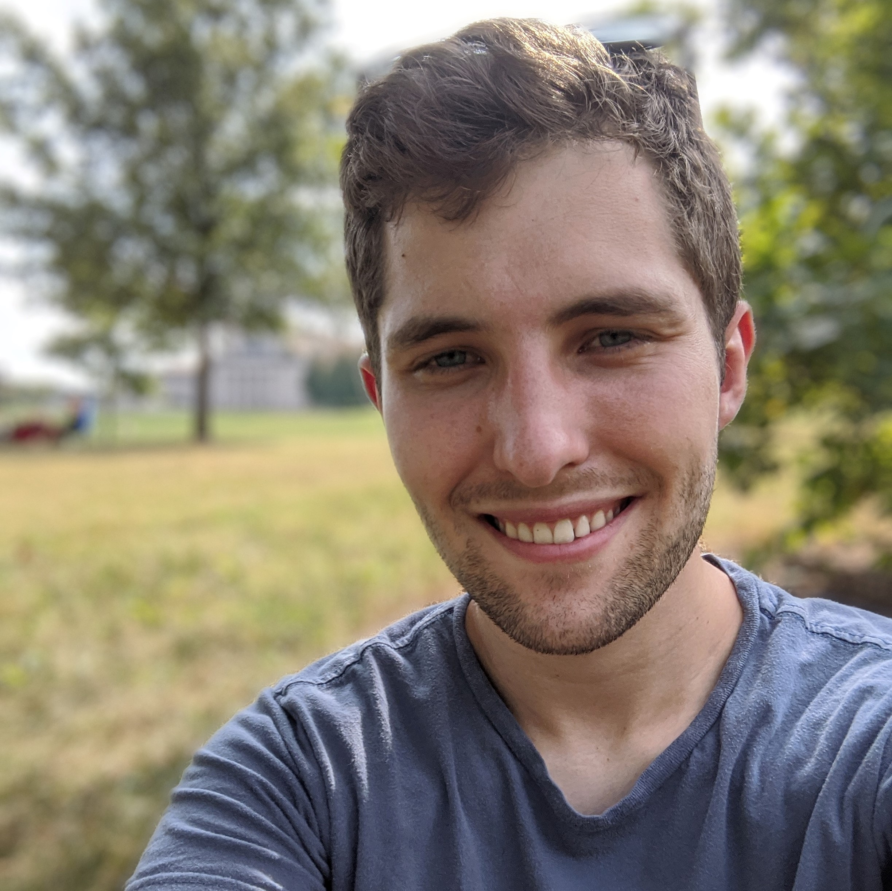
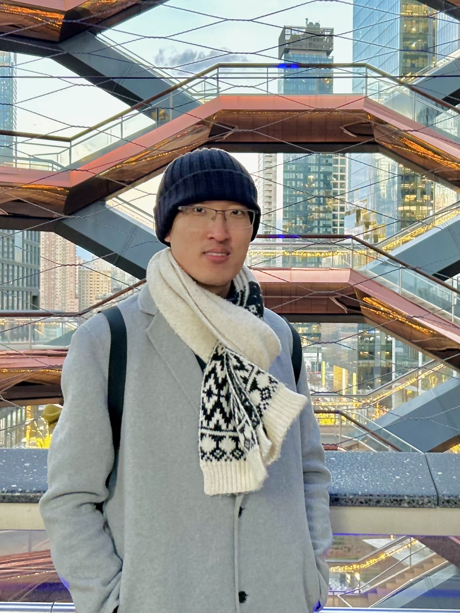

# Fast Robots @ Cornell
[Return to main page](../index.md)

## Teaching Team

### E. Farrell Helbling (she/her)

Farrell is an Assistant Professor at Cornell in the department of Electrical and Computer Engineering. She teaches Fast Robots, a graduate seminar in Micro/ Nano Robotics, and formerly taught ECE2300 from 2021-2023. She runs the [Helbling Robotics Lab](https://hrl.ece.cornell.edu/), which focuses on the design of cm-scale autonomous robots. Her research interests encompass cm-scale manufacturing and assembly techniques, as well as the integration of custom sensing and power systems with severe size, weight, and power constraints. In her spare time, she is either swimming, rowing, or cold plunging (anything to be on the water). 

### Hang "Harry" Gao (he/him)

Hang Gao is a PhD student at Cornell University, advised by Prof. Farrell Helbling. His research focuses on integrating control, sensing, communication, and power electronics into microrobots designed to operate under stringent constraints on computing, memory, latency, and power.

### Cameron Urban (he/him)

Cameron Urban is an MAE PhD student in Dr. Farrell Helbling’s lab. His research is focused on fish-inspired micro robots. He received a Bachelor of Science in mechanical engineering from Washington University in St. Louis. In the past, he has spent time researching bat flight at Brown University, engineering space systems at MIT Lincoln Laboratory, and working with hardware-focused startups in Shenzhen, China. When not working, Cameron enjoys contributing to open-source software projects, scuba diving, and getting beaten in chess.

### Mikayla Lahr

a couple sentence summary for Mikayla.

### Daria Kot

a couple sentence summary for Daria.

### Chenyu "Cheney" Zhang (he/him)

Cheney Zhang is an MAE graduate student from Prof. Helbling’s lab interested in microrobotic systems and biologically-inspired design. In his spare time, he enjoys classical music and tennis. He also loves fossil hunting and cross-country. (He uses macOS 12 with Intel processor)

### Nandita Nagarajan (she/her)

a couple sentence summary for Nandita.

